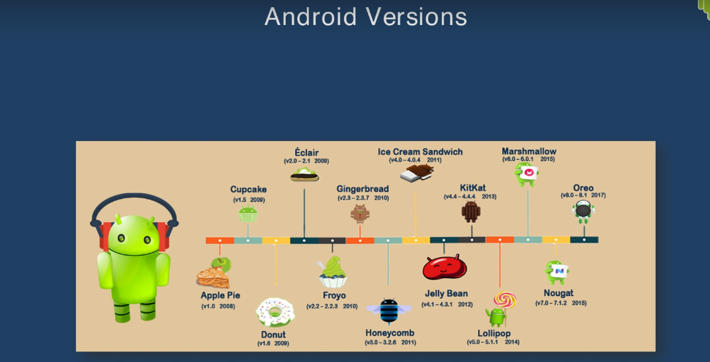
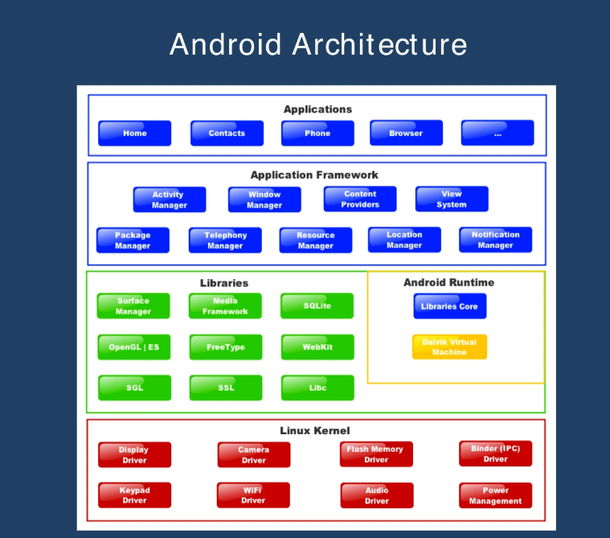

# *Android Application Development*

## *Environment - Android Studio*

## *Developed Applications*
* Application1 - [Understanding Logs](https://github.com/darsigangothri06/Android-Application-Development/tree/main/App1)
* Application2 - [Adding Colors](https://github.com/darsigangothri06/Android-Application-Development/tree/main/IDApp)
  * Understanding 
    * `colors.xml`, `strings.xml`
    * Linear Layout
    * Layout margin
    * colorPrimary, colorPrimaryDark etc
    * Layout gravity
    * Text hint
* Application3 - [ID Application](https://github.com/darsigangothri06/Android-Application-Development/tree/IDApp)
* Application4 - [Finding Temperature using circket chirps](https://github.com/darsigangothri06/Android-Application-Development/tree/main/App4)
* Application5 - [Explicit Intent - Sending and Receiving Data](https://github.com/darsigangothri06/Android-Application-Development/tree/main/App5)
    * Send data from main activity to sister activity - using `putExtra()`
    * Receiving data from sister activity to main activity - `startActivityForResult()`
    * Overriding `onActivityResult()`

* Application6 - [Implicit Intents - Call, Call a friend, Map, Webpage](https://github.com/darsigangothri06/Android-Application-Development)
    * Call - Opening dialer (Asking for application which it has to open)
    * Call a friend - Opening dialer with a default telephone number - `tel:`
    * Maps - Open maps with default location - `geo:0,0?q=`
    * Webpage - Opens a webpage with default address - `Uri.parse()`

## *Introduction*

> What is Android?

* Based on Linux
* Originally Developed by Android Inc.
* Google Purchased Android Inc. in 2005
* Android OS is Open and Free

## *Android Versions*

## *Android Features*

The base adroid system supports features such as

* Storage - Which include SQLite as a light weight relational database
* Connectivity - Like Wifi, Bluetooth, Ethernet etc
* Messaging - Email, SMS etc
* Media Support - MP3, MP4, JPEG, PNG
* Hardware Support - Like Accelerometer, Camera, GPS
* Multi Touch functionality on the screen
* Multi tasking applications as well as tethering or sharing the phone's internet connection as a wireless or a wired hotspot

## *Andoroid Architecture*

## *Android Market*

* Google Play Store

## *Intents*

* Three of the core components of an application which is activity services and broadcast receivers are activated through messages called **Intents**
* The Intent itself an intent object is a passive data structure holding an abstract description of an operation to be performed
* Often in the case of broadcast, a description of something that has happened and is being announced
* Android system finds the appropriate activity, the service of the set of broadcast receivers to respond to the intent and instantiating them if necessary.
* Intent object is just a bundle of information, it contains information of interest to the component that receives the intent such as the action to be taken and data to act on plus some information of interests to the android system such as the category of the component should handle the intent and the instructions on how to launch a target activity.

### *Explicit Intent*

* Explicit intent designate the target component by its name, since components name that generally not to be known to developers of other applications explicit intents are typically used for application internal messages such as an activity starting a subordinate service or launching a sister activity.
* Ex: Moving between different activites of the same application etc

### *Implicit Intent*
* Implicit intent on the other hand do not name a target.
* Implicit intents are often used to activate components in other applications
* In the absence of the designated target, the android system must find the best component(s) to handle the intent.
* Single activity or service to perform a requested action or the set of broadcast receivers to respond to the broadcast announcement etc.
* It does by comparing the content of the intent object to intent filters which are structures assoicated with components that can potentially receiving things.
* Ex: Dial a call, launch website etc.
* 

* 
